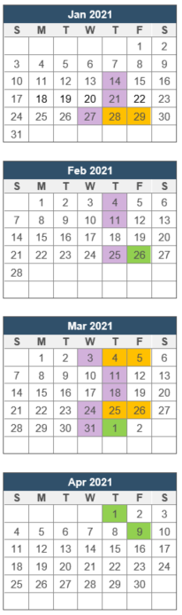

# Assessment Dates and Deadlines at a Glance

||[Topic Tests](./README.md/#topic-tests)  Jan 28 (R): topic test A (coding)  Jan 29 (F): topic test A (written)   Mar 4 (R): topic test B (coding)  Mar 5 (F): topic test B (written)   Mar 25 (R): topic test C (coding)  Mar 26 (F): topic test C (written)  [Assignment Due Dates](./README.md/#assignments)  Feb 26 (F): assignment 1  Apr 01 (R): assignment 2  Apr 9 (F): assignment 3  [Drill Checkpoints](./README.md#drills)  Jan 14 (R)  Jan 21 (R)  Jan 27 (W)  Feb 4 (R)  Feb 11 (R)  Feb 25 (R)  Mar 3 (W)  Mar 11 (R)  Mar 18 (R)  Mar 24 (W)  Mar 31 (W) (last one!)|
|---|:---| 