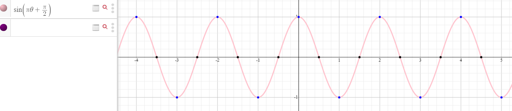

# Code Review Snippets (2021-02-06)

## AlwaysSortedList

### what's Comparable here?!?

I saw this happen quite a bit:

```java
public class AlwaysSortedList<T> implements Comparable<T> {
```

...but it shouldn't! Remember: the T things that going INTO our AlwaySortedList need to implement Comparable<T>, not the AlwaysSortedList itself. (We'll never compare two AlwaysSortedLists, right?)

Now, you can still get the drill to pass if you forget to do this - but you then have to do nasty stuff like:

```java
if (((Comparable<T>) list.get(i)).compareTo(thingToAdd) > 0) {
```

### on-purpose infinite looping

So this is interesting:

```java
while (true) {
      String input = kbd.nextLine().toLowerCase();
      if (input.isEmpty()) {
        System.out.println("> Done now! Thanks!");
        break;
      }
      theList.add(input);
      System.out.println("> contents: " + theList.contents());
    }
```

We have an infinite loop - which is usually a bad thing, right? - but the dev is using a `break` to kick out if an empty input is found.

Some people like doing stuff like this, others despise it. I don't mind either way, as long as the loop is on the short side; otherwise, that break can be hard to scan easily with your eyeballs. Multiple breaks in the same loop? I'd start wondering whether you couldn't restructure things a bit....


## Oscillating Resizable

### the joys of extracting methods

In someone's add, I see

```java
if (arrPos >= size || arrPos <= 0) {
      size += 6;
      T[] copy = (T[]) new Object[size];
      int i = 3;
      for (T t1 : listContents) {
        copy[i] = t1;
        i++;
      }
      listContents = copy;
      arrPos += 3;
    }
```

There's something very specific going on here: a resizing of the backing array, followed by a copying of contents from the old cramped home to the new spacious digs.

So why not just create a method called `resizeIfNeeded` that has the above code in it?

You could also leave the if statement behind, so the add would have this instead: 

```java
if (arrPos >= size || arrPos <= 0) {
  resize();
}
```

I'd likely *also* extract the condition in the if into its own method 

```java
boolean timeToResize() {
  return arrPos >= size || arrPos <= 0;
}
```

and then wind up with this:

```java
if (timeToResize()) {
  resize();
}
```

### math is useful sometimes!

Saw this in the same one as above. It's pretty slick:

```java
int oscillation = -pos * (int) Math.sin((2 * pos + 1) * (Math.PI) / (2));

listContents[oscillation + arrPos] = t;
arrPos += oscillation;
pos++;
```

Do you see what's going on here? You might have to go back to your high school trig and dig around a bit. It might help to rewrite it as

```java
int oscillation = -pos * (int) Math.sin(Math.PI*x + Math.PI / 2);
```

and then plug the sin part into a graphing calculator online. The sin part looks like this:



This is pretty cool. Didn't think to use this myself - wish I had!


### more than one way...

Won't show all of this...but it definitely made me stop and look...

```java
public class Switcher {
  private Foot foot;
  private int multiplier;
  private int[] pedometer;

  public Switcher() {
    foot = Foot.STANDING;
    multiplier = -1;
    pedometer = new int[] {0, 0};
  }

  /**
   * Apparently I need comments. In that case, this is used to help determine if new thing goes on
   * left or right of center (I coulda used booleans, but this might be better for visualising it)
   *
   */
  private enum Foot {
    LEFT,
    RIGHT,
    STANDING
  }
```

I like seeing how different people's brains work!

## Optional

### I love me my ternaries! 

Short(ish), sweet and to the point.

```java
public Optional<T> findBiggest() {

    return thingsInList.isEmpty() ? Optional.empty() : Optional.of(thingsInList.get(size - 1));
  }
```

### don't catch *everything*!

Have to be careful doing this kinda thing:

```java
 try {
      emptyList2.findBiggest();
    } catch (Exception e) {
```

If you're expecting a certain type of exception, catch that type of exception! If you swallow *everything* that's an exception, you might regret it later as problems you should have handled *one* way get swalled by this black hole of catches!