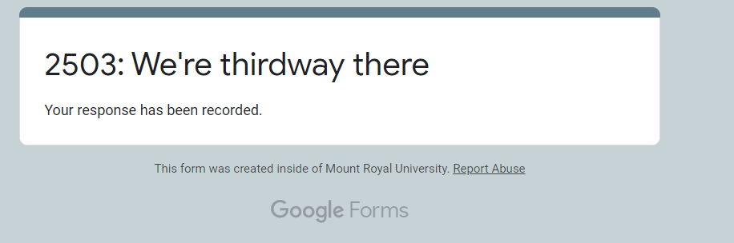

# Lecture 10

**2021-02-12 (F)**

Recording available here: 

Code playground here: https://github.com/MRU-CSIS-2503-202101-001/lecture-playground (do a git pull if you've already cloned this repo before; otherwise, you can clone it into your Eclipse workspace directory)

Anonymous question board here: https://onlinequestions.org/ (20210110)

**!!! Start Recording, JP !!!**

   
## checking in 

[poll link]()

## before we begin

- with 1/3 of the course done, I'd like some feedback (for a Perk)
  - a [3-question form](https://forms.gle/MTVfGFLWU2HkwGCu6) (need to be logged into MRU Google)
  - it doesn't collect email addresses, so it's anonymous
    - but...my Perk!
    - send me an email with a screenshot of your completion screen:
  
  
   
---

## Review

- we built us a fancy linked list
  - insertions and deletions are O(1)
  - traversing...well, that takes time

## The Plan

We'll use our linked list from last time to implement a Stack. Then we'll see what that's bought us.

If we have time, we _might_ dabble a little bit with building a Queue...but since that's the focus of the assignment, _that_ particular pleasure will be largely left to you to experience. 

Right of passage, folks. Right of passage...

## Stack, revisited

- pull up our interface...and start from scratch

  
  
## QUESTIONS?

Ask 'em!

---

**HERE ENDETH THE LESSON**

[EXIT POLL]()

---

## terms used

- [ ] **data structure**
- [ ] **array-backed Stack/Queue**

## your action items

- [ ] hit an assignment checkpoint or two before end-of-day Saturday (if you wanna grab a Perk or 3) [reminder that JP works 12-2:45 on Saturdays]

## coming up

- [ ] linked lists...bring yer pencil & paper

**!!! Stop Recording, JP !!!**