# COMP2503 - Winter 2021

**Things in here will likely shift.  
If deadlines need to change, you will be clearly informed!**

---

## WEEK 01 

|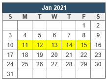| Jan 14 (R): drill checkpoint 0|
|---|:---|

#### instructor notes

- [lec-01 (W)](lectures/01_2021-01-13(W).md)
- [lec-02 (F)](#)

#### topics

- [ ] what's this course all about?
- [ ] tool setup (JDK, Eclipse, plugins, Git)
- [ ] drill system intro
- [ ] getting your Java sea-legs back
- [ ] arrays [[skills]](target-skills.md#arrays)
- [ ] interfaces [[skills]](target-skills.md#java-interfaces)
- [ ] what is equality?  [[skills]](target-skills.md#implementation-of-common-methods)
- [ ] the Comparable interface [[skills]](target-skills.md#comparable)
- [ ] the List interface [[skills]](target-skills.md#list)
- [ ] sorting via `Collections.sort` [[skills]](target-skills.md#collections-library)

---

## WEEK 02 

|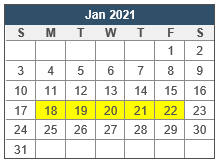| Jan 18 (M): assignment 1 released Jan 19 (T): add/drop deadline Jan 21 (R): drill checkpoint |
|---|:---|

- [ ] generics in kinda depth
- [ ] the Comparator interface
- [ ] simple Java lambdas
- [ ] algorithm analysis

---

## WEEK 03 

|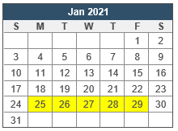| Jan 27 (W): drill checkpoint Jan 28 (R): topic test A (coding) Jan 29 (F): topic test A (writing)|
|---|:---|

- [ ] Java Optional
- [ ] linked structures

---

## WEEK 04 

|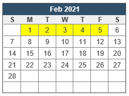|Feb 4 (R): drill checkpoint|
|---|:---|

- [ ] linked lists
- [ ] stacks (array-backed and list-backed)

---

## WEEK 05 

|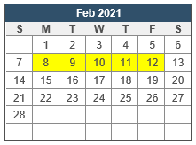| Feb 11 (R): drill checkpoint|
|---|:---|

- [ ] queues (array-backed and list-backed)

---

## WEEK 06 

|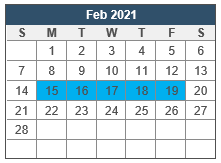| Feb 15 (M): Family Day  Feb 16-19: Reading Break|
|---|:---|
 
- [ ] advanced couch surfing techniques
- [ ] alogorithmically effective slothing

---

## WEEK 07 

|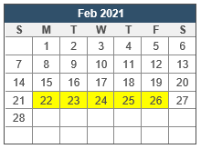| Feb 25 (R): drill checkpoint Feb 26 (F): assignment 1 due|
|---|:---|

- [ ] hash tables

---

## WEEK 08 
|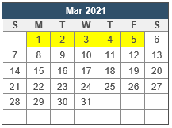| Mar 3 (W): drill checkpoint Mar 4 (R): topic test B (coding) Mar 5 (F): topic test B (written)|
|---|:---|

---

## WEEK 09 
|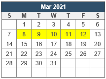| Mar 11 (R): drill checkpoint|
|---|:---|

---

## WEEK 10 
|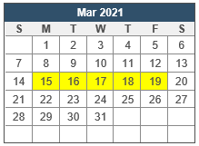| Mar 18 (R): drill checkpoint|
|---|:---|

---

## WEEK 11 
|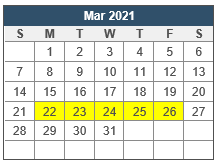| Mar 24 (W): drill checkpoint Mar 25 (R): topic test C (coding) Mar 26 (F): topic test C (written)|
|---|:---|

---

## WEEK 12 
|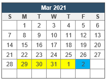| Mar 29 (M): assignment 2 due Apr 01 (R): drill checkpoint (last one!!!) Apr 2 (F): Good Friday (NO LEC)|
|---|:---|
- [ ] almost there, folks...がんばれ!!!

---

## WEEK 13 
|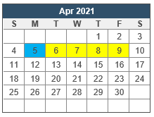| Apr 5 (M): Easter Monday Apr 8 (R): Our last tutorial. Need a hug? Apr 9 (F): assignment 3 due Apr 9 (F): Our last lecture.  Weep not!|
|---|:---|
- [ ] dealer's choice
- [ ] review

---

## WEEK 14: The Not-a-Week-for-Us Week
|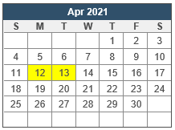| Apr 13 (T): Last day of classes @ MRU Apr 13 (T): Last day to withdraw|
|---|:---|
- [ ] done, done, and **done**! No...really.

---

[1] progress bar images from http://scripts.cac.psu.edu/staff/l/n/lnm105/progressbar.html